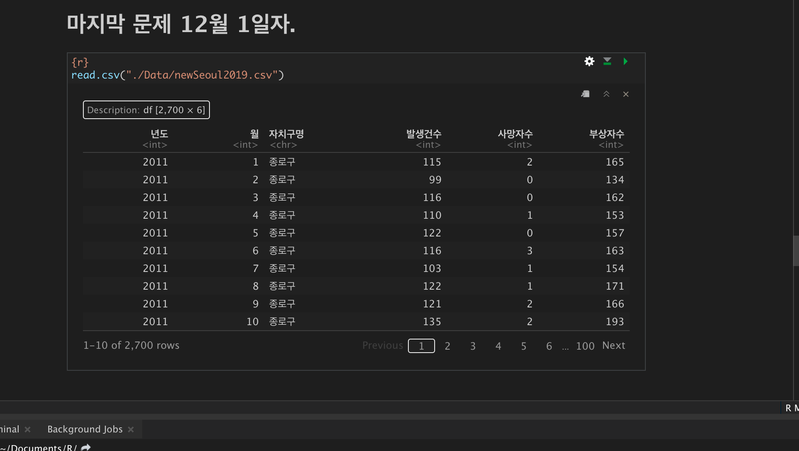

```{r}
#str
library(stringr)
# arrange
library(dplyr)
# 3D chart
library(plotrix)
```

```{r}
#불러오기
seoul <- read.table("./Data/trafficAccident_2011_2019.txt", header=T)

head(seoul)

# - 있는 데이터를 0으로 바꾸기 
seoul <- replace (seoul,seoul=='-','0')

# 천단위 숫자에 , 지우기 
for(i in c(1:ncol(seoul))){
  seoul[,i]<- str_remove_all(seoul[,i],",")
}

# 합계 지우기 
seoul <-(seoul)[,-4] # 컬럼 합게 지욱 
seoul <- subset(seoul,자치구별!='합계') #자치구별에 있는 합계 지우기 
# nrow(seoul) <<<<< 675   나와야댐 


# column에 있는 X n 월을 1~12 로 바꾸기 
# 아 이거 for문으로 돌릴 수 있을텐데 어케 하는지 당장 고민해봐야하겟네 
colnames(seoul)<-c("기간","자치구별","구분","1월","2월","3월","4월","5월","6월","7월","8월","9월","10월","11월","12월")

# ncol(car) # = 15
# nrow(car) # = 675

rownames(seoul)<-c()
head(seoul)
```

# 

```{r}
seoul <- read.table("./Data/trafficAccident_2011_2019.txt", header=T)

head(seoul)
tail(seoul)
```

### 필요없는 컬럼과 열 제거

```{r}
seoul <- seoul[-c(1:3),-4]
head(seoul, 10)
```

### Na 확인

```{r}
for(i in 1:ncol(seoul)){
  print(sum(is.na(seoul[,i]))) # 컬럼별로 다 보겠다
}
```

### 컬럼 이름 정리

```{r}
paste(1:12,"월",sep ="")
c('기간','자치구별','구분',paste(1:12,"월",sep =""))
colnames(seoul)<-c('기간','자치구별','구분',paste(1:12,"월",sep =""))

colnames(seoul)
```

### rownames 정리

```{r}

rownames(seoul) <- c()
tail(seoul,10)
```

### 잘 된건지, 맞는지 현재 DataSet의 row 수 계산

ㅇ

```{r}
9*3*25
# 9 = seoul$기간
# 3 = unique(seoul$구분)
# 25 = 자치구별 

```

### 컬럼별 Data 확인

```{r}
unique(seoul$기간)
```

```{r}
unique(seoul$구분)
```

```{r}
unique(seoul$자치구별)   # 여기에 합계라는 녀석이 있구나 ??! 
length(unique(seoul$자치구별)) # <- 26
```

### 자치구별에 있는 합계 row 를 제거

```{r}
subset(seoul, 자치구별 == '합계')
rownames(subset(seoul, 자치구별 == '합계'))
as.numeric(rownames(subset(seoul, 자치구별 == '합계')))
row_hap <- as.numeric(rownames(subset(seoul, 자치구별 == '합계')))

seoul <- seoul[-row_hap,]
nrow(seoul) # = 675 
head(seoul)
```

```{r}
unique(seoul$자치구별)
```

\-\-\--

# 전처리 하여 new dataframe 만들기

```{r}
# 년도 9개
# 자치구 25개
# 1~12월 12개
9*25*12 # = 2700
# row수는 2700개가 나오는구나 
```

```{r}
년도 <- rep(2011:2019, each = (25*12))
월 <- rep(1:12, 9*25)
자치구명 <- rep(rep(unique(seoul$자치구별), each=12),9)
  # 자치구명 하나가 일단 12번 나와야되고 그 다음에 9번 나와야댐
  # 어케 해야될지 햇갈리니까 일단 연습 한번 해보고 넣으면 댐 
  
```

```{r}
rep(rep(unique(seoul$자치구별), each=12),9)

length(년도)
length(월)
length(자치구명)
tail(rep(rep(unique(seoul$자치구별), each=12),9))
# 3개 다 2700개로 만들어 졌음
```

## 새로운 Data Frame 제작

```{r}
newSeoul <- data.frame(년도,월,자치구명)
head(newSeoul)
tail(newSeoul)
nrow(newSeoul)
newSeoul
# 이제 옆에 숫자를 붙이면 됨 
```

### 기존 data를 newSeoul에 new format에 맞추기

```{r}
#잘못쓰면 깽판나니까 연습함 해보고
seq(1,673,3) 

```

```{r}
temp <- c()
temp <- seoul[1:3, 4:ncol(seoul)]
temp 
class(t(temp))
t(temp) # 문자네 이제 column에 4~6이 붙어서 내려가야되니까 rbind가 필요하겠구나 

```

```{r}
seoul
temp <- c()
temp
t(seoul)
for(i in seq(1,673,3)){
  temp <- rbind(temp,t(seoul[i:(i+2), 4:ncol(seoul)]))
}
head(temp) # rownames 의 1~12월이 있으면 newSeoul이랑 안맞음 
tail(temp)
temp
```

### rownames 지우기

```{r}
rownames(temp)<- c()
tail(temp)
```

```{r}
newSeoul <- cbind(newSeoul , temp)
head(newSeoul)
```

### newSeoul의 컬럼이름 변경

```{r}
colnames(newSeoul) <- c('년도','월','자치구명','발생건수','사망자수','부상자수')
head(newSeoul,25)
```

\-\-\--

## newSeoul 정제하기

만든게 잘 만들어 졌나 na 확인해보기

```{r}
for(i in 1:ncol(newSeoul)){
  print(sum(is.na(newSeoul[,i]))) # 컬럼별로 다 보겠다
}
```

내부구조 확인

```{r}
str(newSeoul)
```

### 각 열의 -을 0으로 변환하기 + 천단위 쉼표 없애기? \< 합계에만 천단위가 있어서 넘어

```{r}
# library(stringr)
```

```{r}
for(i in 4:ncol(newSeoul)){
  newSeoul[,i] <- str_replace_all(newSeoul[,i],'-','0') 
  #newSeoul[,i] <-str_remove_all(newSeoul[,i],',')  쉼표 없애기
}
str(newSeoul)
```

### 월 Data의 type 을 숫자로 변경하기

```{r}
for(i in 4:ncol(newSeoul)){
  newSeoul[,i] <- as.numeric(newSeoul[,i])
}
str(newSeoul)
```

```{r}
head(newSeoul)
```

## 다 된거 같은데? 저장하기

```{r}
write.csv(newSeoul, "./Data/newSeoul.csv", row.names = F)
```

# 데이터 확인 작업

```{r}
plot(newSeoul$발생건수, newSeoul$부상자수)
```
