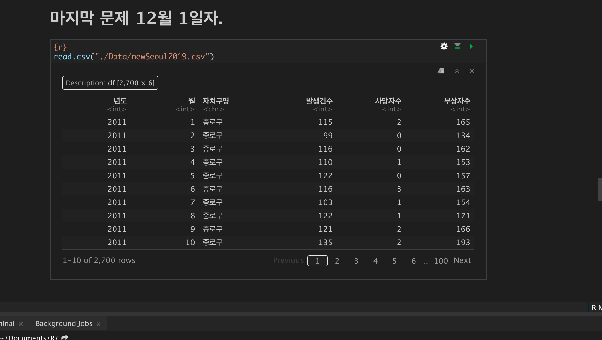

```{r}
#str
library(stringr)
# arrange
library(dplyr)
# 3D chart
library(plotrix)
```

```{r}
car <- read.table("./Data/trafficAccident_2011_2019.txt", header=T)
head(car)
tail(car)
sum(is.na(car))


tail(read.csv("./Data/newSeoul2019.csv", header=T))
```

```{r}
str(car)
```

```{r}
head(car)
```

### '-' 를 숫자 0으로 바꾸기

```{r}

sum(car=='-')
car <- replace (car,car=='-','0')
head(car)
```

1\~12월은 안궁금하다

```{r}
head(car[,c(1:4)])
```

## 합계는 필요가 없다 믿을 수 없다 합계를 따로 구하자 전에 시댕 왜 자구 숫자로 안바뀌나 했더니 숫자에 , 이 있어서 캐릭터였늠 ㅡㅡ

```{r}
# for문으로 천단위 , 지우기 

for(i in c(1:ncol(car))){
  car[,i]<- str_remove_all(car[,i],",")
  print(i)
}
ncol(car) # = 16
```

## 합계가 들어간건 다 지우기?

```{r}
(car)[,-4]
car <-(car)[,-4] # 컬럼 합게 지욱 
car
head(subset(car,자치구별!='합계')) 
# car <- subset(car,자치구별!='합계') #자치구별에 있는 합계 지우기 
car

```

## 자치구별 데이터가 균일하게 들어 있는지 확인

```{r}
table(car$자치구별)
```

# == 예제 전 )자치구별 발생건수가 높은 순으로 정렬

```{r}
# 1. 발생건수만 보이게 함 
car_balsang <- subset(car,car$구분=='발생건수')
car_balsang

# 2. 발생건수에서 높은 순으로 보이게 함
car_balsang <- arrange(car_balsang,desc(car_balsang$합계))
car_balsang[]

```

### == 예제 전 )년도가 11\~19년도 까지 있네

```{r}
table(car$기간)
```

# 알아서 정제하는줄 알앗는데 강사님이 보여준게 잇엇음

# 

이렇게 만들기

# 초기 세팅 시작

```{r}
#불러오기
car <- read.table("./Data/trafficAccident_2011_2019.txt", header=T)

# - 있는 데이터를 0으로 바꾸기 
car <- replace (car,car=='-','0')

# 천단위 숫자에 , 지우기 
for(i in c(1:ncol(car))){
  car[,i]<- str_remove_all(car[,i],",")
}

# 합계 지우기 
car <-(car)[,-4] # 컬럼 합게 지욱 
car <- subset(car,자치구별!='합계') #자치구별에 있는 합계 지우기 

# column에 있는 X n 월을 1~12 로 바꾸기 
# 아 이거 for문으로 돌릴 수 있을텐데 어케 하는지 당장 고민해봐야하겟네 
colnames(car)<-c("기간","자치구별","구분","1월","2월","3월","4월","5월","6월","7월","8월","9월","10월","11월","12월")

# ncol(car) # = 15
# nrow(car) # = 675

rownames(car)<-c()
head(car)
```



뒤집기

```{r}
car[1:3,3:15]
t(car[1:nrow(car),3:15])
as.data.frame(t(car[1:3,4:15]))
test_car <- as.data.frame(t(car[1:3,4:15]))
test_car
colnames(test_car)<-c("발생건수" ,"사망자수","부상자수")
test_car

test_car_0<- cbind(test_car_0,test_car$발생건수)

head(test_car_0)
test_car_0 <- car
```

### 이후 이어서

1:3 \<\<\< 이 부분은 for로 시작부분을 늘린다음에 반복해서 밑으로 쭉 붙힌다음에 나중에 합치면 될거같음

# 발생자수와 사망자수의 산포도
